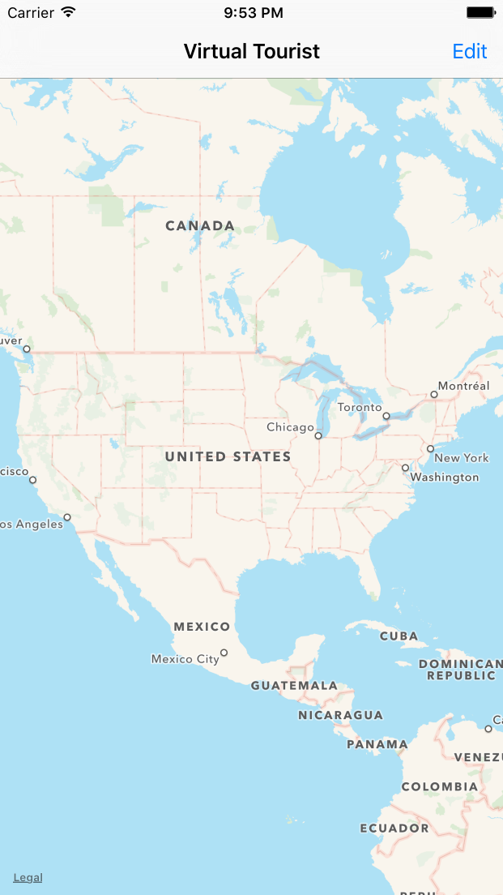
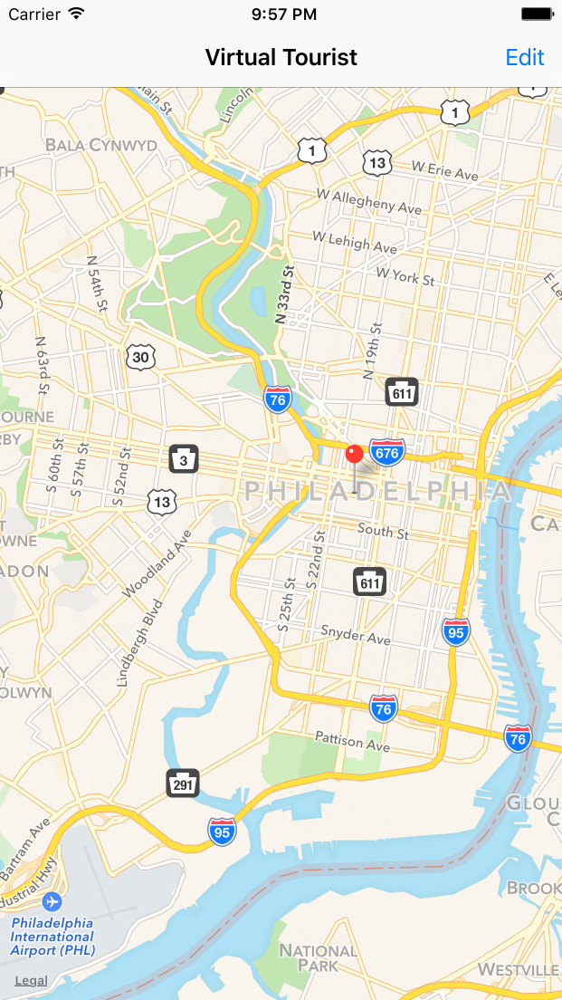
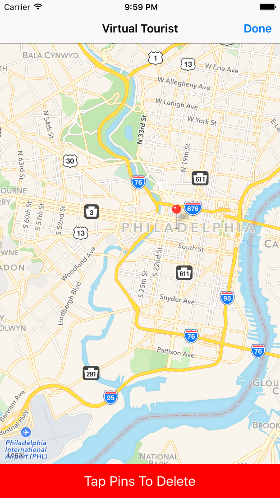
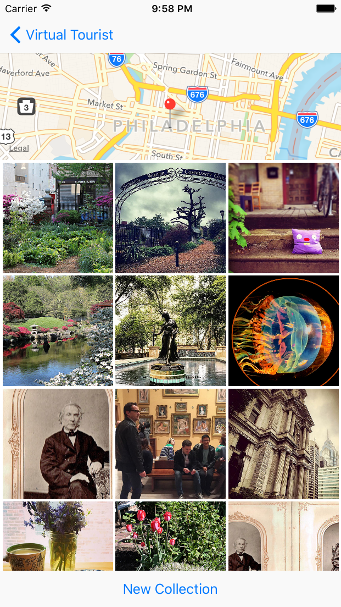
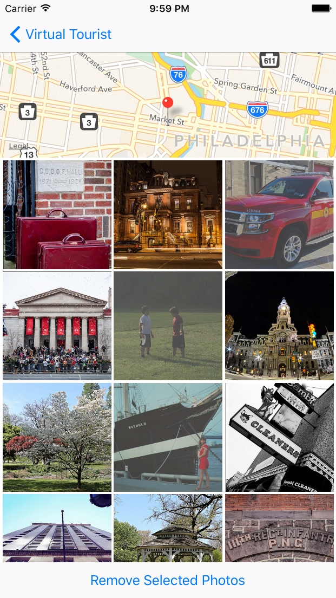

# Virtual Tourist
Portfolio Project 4 for Udacity iOS Developer Nanodegree

Commit message style follows the Udacity style guide: https://udacity.github.io/git-styleguide/

This app allows users to place pins on a map and download photos from Flickr that are near that location.
The app uses Core Data to persist the user's pinned locations and photos. The last viewed region of the map is saved using NSUserDefaults, and the photo image files are saved to the device's Documents directory.

Screenshots below are shown on the iOS simulator for an iPhone 6s Plus.

####NOTE: 
This app requests data from Flickr's API.  You will need to enter anAPI key in `FlickrConstants.swift` to run the app on your machine. If you do not have an API key, you can request one here: https://www.flickr.com/services/apps/create/apply/

##Walkthrough

The initial screen shows a map view.

Pins are added by long-pressing on the map.

Pins can be deleted by pressing the edit button.

Tapping a pin when not editing brings up the photo album view.

A new set of photos can be retrieved by pressing "New Collection".  Tapping on individual pictures will select them 
for deletion.

